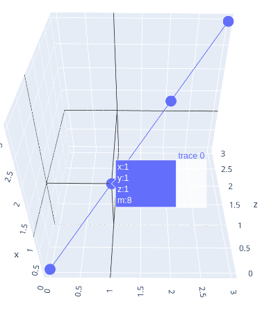
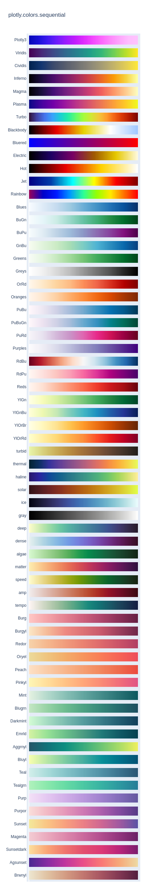

# Configurações  Plotly Graphs Objects

# Update-Layout

## height

> altura

## width

> largura

## plot_bgcolor

> cor de fundo do grafico 

## paper_bgcolor

> cor de fundo fora do grafico

## Title

* __text__ : define o nome do titulo

* __font__
  
  * family
  
  * size
  
  * color

* __xref__ : Especifica o sistema de coordenadas usado para posicionar o título ao longo do eixo x.

* __yref__: Semelhante ao `xref`, mas para posicionar o título ao longo do eixo y.

* __x__ : posição no eixo vertical **`[0,1]`**

* __y__: posição no eixo horizontal **`[0,1]`**

* __xanchor__ : Especifica a âncora horizontal do título em relação à posição definida em `x`. Pode ser **`auto`, `left`, `center` ou `right`.**

* __yanchor :__ Semelhante ao `xanchor`, mas para a âncora vertical do título em relação à posição definida em `y`. Pode ser **`auto`, `top`, `middle` ou `bottom`.**

* __automargin__: Margens adequadas para o título e garantirá que ele seja exibido sem sobrepor-se a outros elementos do gráfico. **`True` or `False`.**

```python
   title = dict(
        text = 'Meu Gráfico Personalizado',
        font = dict (
            family= 'Arial', 
            size  =  24, 
            color = 'blue'
        ),
        xref = 'paper',
        yref = 'paper',
        x= 0.5,
        y= 0.95,
        xanchor = 'center',
        yanchor = 'top'
    )
```

> Pode usar o formato padrão de dicionario `{}`

&nbsp;

## legend

* __bgcolor__: cor de fundo da legenda.

* __bordercolor__: cor das bordas.

* __borderwidth__: largura da borda.

* __orientation__ : orientação da legenda.

* __title__: tem as funções de **`title`**.

* __font__: tem as funções de **`title:font`**.

* __entrywidth__:largura da legenda.

* __entrywidthmode__:tipo de largura **`px(pixel)`** ou **`fr(fraction)`**.

* __xref,yref__

* __x,y__

* __xanchor__

* __yanchor__

* __automargin__

```python
fig.update_layout(
    legend={
        'bgcolor'    :'purple',
        'bordercolor':'black',
        'borderwidth':20,
        'orientation':'h',
        'entrywidth' :500,
        'entrywidthmode':'pixels',
        'visible'       :True,
        'title':{
            'text':'rara',
            'font':{
                'size'  :16,
                'family':'arial',
                'color' :'white'
            }
        },
        'font':{
            'size'  :16,
            'family':'arial',
            'color' :'white'
        },
        'x':0.5,
        'y':0.5,
        'xanchor':'center',
        'yanchor':'bottom'
    }
)
```

&nbsp;

## hovermode

> __`x`__ , __`y`__ , __`closest`__ ,__`default`__ , __`({x} ou {y}) unified`__ , __`closest`__

&nbsp;

## hoverlabel

* **bgcolor**: Define a cor de fundo do rótulo flutuante.

* **bordercolor** : Define a cor da borda do rótulo flutuante.

* **font**: mesmas funcoes do **`title:font`**

* **align**: Define o alinhamento do rótulo flutuante em relação ao ponto de dados. **`"auto"`, `"left"`, `"right"`, `"top"`, `"middle"`, `"bottom"` ou combinações como `"left top"`**.

* **namelength** : Define o comprimento máximo do nome da série exibido no rótulo flutuante.

```python
fig.update_traces(
    hoverlabel=dict(
        bgcolor     = 'lightblue',
        bordercolor = 'black',
        font = dict(
            family = 'Arial', 
            size   = 20, 
            color  = 'black'),
        align = 'left',
        namelength = 10,
    )
)
```

&nbsp;

## xaxis & yaxis

* __title__: Define o título do eixo x. mesmas funcoes do **`title`**

* __type__: Define o tipo do eixo x. As opções mais comuns são `"linear"` (eixo numérico) e `"category"` (eixo de categoria).

* __range__: Define o intervalo de valores exibidos no eixo x. Pode ser uma lista com dois valores representando o início e o fim do intervalo.

* __tickmode__: Define o modo de exibição dos ticks (marcadores) no eixo x. As opções são `"auto"` (calcula automaticamente), `"linear"` (especifica manualmente os ticks de forma linear) ou `"array"` (especifica manualmente os ticks usando a propriedade `tickvals`).

* __tickvals__: Lista de valores numéricos que especificam a posição dos ticks no eixo x (usada quando `tickmode` é definido como `"array"`).

* __ticktext__: Lista de strings que especificam o texto exibido nos ticks (usada quando `tickmode` é definido como `"array"`).

* __tickfont__(family=None, size=None, color=None): Permite personalizar o estilo da fonte usada nos ticks do eixo x.

* __showgrid__: Define se as linhas de grade (grid) são exibidas no eixo x.**`True`ou `falso`**

* __gridwidth__: Define a largura das linhas de grade no eixo x em pixels.

* __gridcolor__: Define a cor das linhas de grade no eixo x.

```python
fig.update_layout(
    xaxis=dict(
        title=dict(
            text = 'nome',
            font = dict(
                size  = 16,
                color = 'red'
            ) 
        ),
        type     = 'linear',  
        tickvals = [1, 2, 3, 4],  
        ticktext = ['A', 'B', 'C', 'D'],
        tickfont = dict(
            size = 15, 
            color='green'),  
        showgrid =True,  
        gridwidth=1,          
        gridcolor='lightgrey' 
    ),
    yaxis = dict(
        type  ='linear',  
        range =[0, 20],  
        tickfont = dict(
            size  = 10, 
            color ='purple'),  
        showgrid  = True, 
        gridwidth = 1,  
        gridcolor ='lightgrey'  
    )
)
```


```python
xaxis_params = {
    'anchor': 'y',  # O eixo ao qual o eixo X será ancorado. Padrão é 'y'.
    'automargin': False,  # Se o ajuste automático da margem deve ser ativado.
    'categoryorder': 'trace',  # Ordem de categorias (para gráficos categóricos).
    'color': 'black',  # Cor da linha e do título do eixo X.
    'exponentformat': 'none',  # Formato do exponencial no eixo.
    'fixedrange': False,  # Se o zoom é permitido ou não.
    'gridcolor': 'gray',  # Cor das linhas da grade.
    'gridwidth': 1,  # Largura das linhas da grade.
    'griddash': 'solid',  # Estilo da linha da grade ('solid', 'dot', 'dash', etc.).
    'linecolor': 'black',  # Cor da linha do eixo.
    'linewidth': 2,  # Largura da linha do eixo.
    'mirror': False,  # Se o eixo será refletido.
    'showgrid': True,  # Se as linhas da grade devem ser exibidas.
    'showline': True,  # Se a linha do eixo X deve ser exibida.
    'showticklabels': True,  # Se os rótulos das marcas devem ser exibidos.
    'showtickprefix': 'none',  # Se deve exibir um prefixo antes dos ticks (ex: 'all', 'first', 'last').
    'showticksuffix': 'none',  # Se deve exibir um sufixo após os ticks (ex: 'all', 'first', 'last').
    'tick0': 0,  # O valor inicial do tick (em gráfico numérico).
    'tickangle': 0,  # Ângulo dos rótulos de ticks em graus.
    'tickcolor': 'black',  # Cor dos rótulos de ticks.
    'tickfont': {'size': 12, 'color': 'black'},  # Fonte dos rótulos de ticks.
    'tickformat': '',  # Formato para ticks (formatação numérica, por exemplo).
    'tickformatstops': [],  # Parâmetros adicionais para formatação de ticks.
    'ticklen': 6,  
    'tickmode': 'auto',  # Como os ticks são posicionados ('auto', 'array').
    'tickprefix': '',  # Prefixo dos valores dos ticks.
    'ticks': 'outside',  # Onde os ticks são posicionados ('inside', 'outside', 'none').
    'tickson': 'boundaries',  # Se os ticks são nas bordas ou no meio dos intervalos.
    'ticksuffix': '',  # Sufixo dos valores dos ticks.
    'tickvals': [],  # Valores dos ticks se o modo for 'array'.
    'tickwidth': 2,  # Largura dos ticks.
    'title': {'text': 'X Axis Title', 'font': {'size': 18}, 'standoff': 15},  # Título do eixo X.
    'titlefont': {'size': 18, 'color': 'blue'},  # Fonte do título do eixo X.
    'title_standoff': 15,  # Distância do título do eixo.
    'type': 'linear',  # Tipo de escala do eixo ('linear', 'log', 'date', 'category').
    'zeroline': True,  # Se deve exibir a linha zero.
    'zerolinecolor': 'black',  # Cor da linha zero.
    'zerolinewidth': 2,  # Largura da linha zero.
    'rangeslider': {'visible': True},  # Configuração do slider de faixa.
    'range': [0, 100],  # Intervalo de valores para o eixo X.
    'scaleanchor': 'y',  # Escala do eixo X ancorada no eixo Y.
    'scaleratio': 1,  # Razão de escala entre os eixos.
    'nticks' : 1 # Comprimento dos ticks.
}
```
&nbsp;

&nbsp;

# update_traces

## hovertemplate

> pode usar no proprio grafico

```python
import plotly.graph_objects as go

fig = go.Figure()

fig.add_trace(
    go.Scatter3d(
        x = [0,1,2,3],
        y = [0,1,2,3],
        z = [0,1,2,3],
        text = [9,8,7,6]
    )
)

fig.update_traces(
    hovertemplate='<br>x:%{x}<br>y:%{y}<br>z:%{z}<br>m:%{text}'
    )
```




## Parametros gerais para Bar, Scatter, Pie
O método `update_traces()` no Plotly permite atualizar propriedades de todos os traços (`traces`) de um gráfico sem precisar recriar a figura. Aqui estão os principais parâmetros que podem ser utilizados:

---

### **Parâmetros Gerais do `update_traces()`**
Os parâmetros variam conforme o tipo de gráfico (`go.Scatter`, `go.Bar`, `go.Pie`, etc.), mas aqui estão alguns parâmetros gerais:

- **`name`**: Nome do traço (aparece na legenda).
- **`visible`**: Define a visibilidade (`True`, `False`, `"legendonly"`).
- **`opacity`**: Define a transparência (0 a 1).
- **`legendgroup`**: Agrupa legendas de traços relacionados.
- **`marker`**: Personaliza os marcadores (cor, tamanho, borda).
- **`line`**: Personaliza linhas (cor, estilo, largura).
- **`text`**: Define os textos que aparecem em pontos de dados.
- **`hoverinfo`**: Define informações exibidas no hover.
- **`hoverlabel`**: Personaliza a aparência do hover.
- **`showlegend`**: Exibe ou esconde a legenda.
- **`mode`** (para gráficos de dispersão): `"lines"`, `"markers"`, `"text"`, `"lines+markers"`, etc.

---

### **Parâmetros por Tipo de Gráfico**
#### 🔹 **Para `go.Scatter` (Gráfico de Dispersão)**
```python
fig.update_traces(
    mode="markers+lines",  # Mostrar marcadores e linhas
    marker=dict(size=10, color="blue", symbol="circle"),
    line=dict(width=2, dash="dash"),  # Estilo da linha
    hoverinfo="text+x+y",
    showlegend=True
)
```

#### 🔹 **Para `go.Bar` (Gráfico de Barras)**
```python
fig.update_traces(
    marker=dict(color="red", line=dict(width=2, color="black")),  # espessura barras
    marker_line_color='black',# cora da borda
    marker_line_width=0.5, #bordas espessura
    opacity=0.9, # transparencia
    textposition="outside",
    hoverinfo="text+y"
)
```

#### 🔹 **Para `go.Pie` (Gráfico de Pizza)**
```python
fig.update_traces(
    pull=[0, 0.1, 0, 0],  # Destacar fatias específicas
    textinfo="label+percent",
    hoverinfo="label+value",
    marker=dict(line=dict(color="black", width=2))
)
```

---

### **Exemplo Completo**
```python
import plotly.graph_objects as go

fig = go.Figure(data=[
    go.Scatter(x=[1, 2, 3], y=[4, 1, 7], mode="lines+markers", name="Série 1"),
    go.Bar(x=["A", "B", "C"], y=[5, 2, 8], name="Barras")
])

# Atualizando traços
fig.update_traces(
    marker=dict(size=12, color="red"),
    line=dict(width=3, dash="dot"),
    hoverinfo="x+y+text",
    showlegend=True
)

fig.show()
```

Isso permite modificar todas as séries do gráfico de uma vez! 🚀
&nbsp;

&nbsp;

# BAR

#### cliponaxis

* **Descrição**: Um valor booleano que determina se as barras devem ser cortadas quando estão fora dos limites do eixo. Se definido como `true`, as barras podem ser cortadas se estiverem além dos limites do gráfico.
  
  - **Tipo**: Booleano
  - **Exemplo**: `cliponaxis: true`

&nbsp;

#### constraintext

* **Descrição**: Restringe o comprimento do texto na legenda para que ele se ajuste dentro do gráfico, impedindo que o texto se sobreponha a outras partes do gráfico.
  * **Tipo**: String (valores possíveis: `'both'`, `'outside'`, `'inside'`)
  * **Exemplo**: `constraintext: 'both'`
    &nbsp;

#### customdata

* **Descrição**: Permite associar dados personalizados às barras para uso em eventos de clique ou informações de dica.
  * **Tipo**: Array
  * **Exemplo**: `customdata: [10, 15, 20, 25]`

&nbsp;

#### customdatasrc

* **Descrição**: A fonte dos dados personalizados associados às barras. Indica de onde os valores de `customdata` devem ser retirados.
  * **Tipo**: Array
  * **Exemplo**: `customdatasrc: ['source1', 'source2', 'source3', 'source4']`

&nbsp;

#### dx

* **Descrição**: Um deslocamento em x que permite ajustar a posição das barras em relação à sua posição padrão no eixo x.
  * **Tipo**: Número
  * **Exemplo**: `dx: 0.1`

&nbsp;

#### dy

* **Descrição**: Um deslocamento em y que permite ajustar a posição das barras em relação à sua posição padrão no eixo y.
  * **Tipo**: Número
  * **Exemplo**: `dy: -0.2`

&nbsp;

#### error_x

* **Descrição**: Permite definir barras de erro nas coordenadas x das barras. As barras de erro são usadas para representar incertezas ou variações nos valores das coordenadas x.
  * **Tipo**: Objeto (com os seguintes parâmetros):
    * `array`: Um array de valores numéricos que define as barras de erro positivas (direção direta do eixo x).
    * `arrayminus`: Um array de valores numéricos que define as barras de erro negativas (direção oposta ao eixo x).
    * `color`: Define a cor das barras de erro.
  - **Exemplo**: `error_x  = {array: [1, 2, 3], arrayminus: [0.5, 1, 1.5], color: 'red'}`

&nbsp;

#### error_y

* **Descrição**: Permite definir barras de erro nas coordenadas y das barras. As barras de erro são usadas para representar incertezas ou variações nos valores das coordenadas y.
  
  * **Tipo**: Objeto (com os seguintes parâmetros):
    * `array`: Um array de valores numéricos que define as barras de erro positivas (direção direta do eixo y).
    * `arrayminus`: Um array de valores numéricos que define as barras de erro negativas (direção oposta ao eixo y).
    * `color`: Define a cor das barras de erro.
    * **Exemplo**: `{array: [0.5, 1, 1.5], arrayminus: [0.2, 0.7, 1.0], color: 'blue'}`

&nbsp;

#### hoverinfo

* **Descrição**: Controla as informações exibidas quando o mouse paira sobre as barras. Você pode personalizar as informações exibidas nesse momento.
  * **Tipo**: String ou Array de Strings
  * **Exemplo**: `hoverinfo: 'y+name'`

&nbsp;

#### hoverlabel

* **Descrição**: Configurações para personalizar a aparência da dica de ferramenta (hover label) que aparece quando você passa o mouse sobre as barras.
  * **Tipo**: Objeto (com vários parâmetros, incluindo `bgcolor`, `bordercolor`, etc.)
  * **Exemplo**: `{bgcolor: 'lightgray', bordercolor: 'black'}`

&nbsp;

#### hovertemplate

* **Descrição**: Permite criar um modelo personalizado para a dica de ferramenta (tooltip) exibida quando você passa o mouse sobre as barras. Você pode usar variáveis de dados específicas.
  * **Tipo**: String
  * **Exemplo**: `hovertemplate: 'Valor: %{y}'`

&nbsp;

#### hovertemplatesrc

* **Descrição**: A fonte do modelo de dica de ferramenta personalizado (hover template). Indica de onde o modelo deve ser retirado.
  * **Tipo**: String (nome da coluna)
  * **Exemplo**: `hovertemplatesrc: 'dados_hovertemplate'`

&nbsp;

#### hovertext

* **Descrição**: Define o texto que aparece na dica de ferramenta (tooltip) quando você passa o mouse sobre as barras.
  * **Tipo**: String ou Array de Strings
  * **Exemplo**: `hovertext: 'Dados de barras'`

&nbsp;

#### hovertextsrc

* **Descrição**: A fonte do texto da dica de ferramenta. Indica de onde o texto deve ser retirado.
  * **Tipo**: String (nome da coluna)
  * **Exemplo**: `hovertextsrc: 'dados_hovertext'`

&nbsp;

#### insidetextanchor

* **Descrição**: Controla a ancoragem do texto dentro das barras em relação ao eixo y.
  * **Tipo**: String (valores possíveis: `'start'`, `'middle'`, `'end'`)
  * **Exemplo**: `insidetextanchor: 'middle'`

&nbsp;

#### insidetextfont

* **Descrição**: Define a fonte do texto que está dentro das barras.
  
  * **Tipo**: Objeto (com vários parâmetros, incluindo `family`, `size`, `color`, etc.)
  
  * **Exemplo**: `insidetextfont: {family: 'Arial', size: 12, color: 'black'}`

&nbsp;

#### legend

* **Descrição**: Define um nome para a série de dados das barras na legenda do gráfico.
  * **Tipo**: String
  * **Exemplo**: `legend: 'Série A'`

&nbsp;

#### legendgroup

* **Descrição**: Controla como as séries de dados são agrupadas na legenda do gráfico, permitindo que você as organize.
  * **Tipo**: String
  * **Exemplo**: `legendgroup: 'grupo1'

&nbsp;

#### legendgrouptitle

* **Descrição**: Permite adicionar um título ao grupo de séries de dados na legenda do gráfico.
  
  * **Tipo**: String
    * **Exemplo**: `legendgrouptitle: 'Grupo 1'`

&nbsp;

#### legendrank

* **Descrição**: Define a ordem de classificação das séries de dados na legenda do gráfico.
  * **Tipo**: Número
  * **Exemplo**: `legendrank: 2`

&nbsp;

#### legendwidth

* **Descrição**: Define a largura das entradas da legenda para esta série de dados.
  * **Tipo**: Número
  * **Exemplo**: `legendwidth: 150`

&nbsp;

#### marker

* **Descrição**: Define a aparência das barras, incluindo cor, tamanho e outros atributos visuais.
  * **Tipo**: Objeto (com vários parâmetros, incluindo `color`, `size`, `line`, etc.)
  * **Exemplo**: `{color: 'blue', size: 8}`

&nbsp;

#### meta

* **Descrição**: Permitem associar metadados às barras, fornecendo informações adicionais que podem ser usadas em eventos ou dicas.
  * **Tipo**: Array
  * **Exemplo**: `meta: ['info1', 'info2', 'info3']`

&nbsp;

#### name

* **Descrição**: Define um nome para a série de dados das barras, que é exibido na legenda do gráfico.
  * **Tipo**: String
  * **Exemplo**: `'Série A'`

&nbsp;

#### offset

* **Descrição**: Define um deslocamento para as barras em relação ao eixo. Isso pode ser usado para ajustar a posição das barras.
  * **Tipo**: Número
  * **Exemplo**: `offset: 0.2`

&nbsp;

#### offsetgroup

* **Descrição**: Define um grupo de deslocamento para as barras, permitindo que grupos de barras sejam deslocados separadamente.
  * **Tipo**: String
  * **Exemplo**: `offsetgroup: 'grupo1'`

&nbsp;

#### opacity

* **Descrição**: Define a opacidade das barras, controlando sua transparência.
  * **Tipo**: Número entre 0 (totalmente transparente) e 1 (totalmente opaco).
  * **Exemplo**: `opacity: 0.7`

&nbsp;

#### orientation

* **Descrição**: Define a orientação do gráfico de barras, que pode ser horizontal (`'h'`) ou vertical (`'v'`).
  * **Tipo**: String
  * **Exemplo**: `orientation: 'v'`

&nbsp;

#### outsidetextfont

* **Descrição**: Controla a fonte do texto que está fora das barras, se aplicável.
  * **Tipo**: Objeto (com vários parâmetros, incluindo `family`, `size`, `color`, etc.)
  * **Exemplo**: `outsidetextfont: {family: 'Arial', size: 12, color: 'black'}`

&nbsp;

#### selected

* **Descrição**: Permitem configurar o comportamento das barras quando selecionadas pelo usuário.
  * **Tipo**: Objeto (com vários parâmetros, incluindo `marker`, `opacity`, etc.)
  * **Exemplo**: `{marker: {color: 'red'}, opacity: 0.8}`

&nbsp;

#### selectedpoints

* **Descrição**: Define quais pontos de dados devem ser selecionados quando as barras são clicadas.
  * **Tipo**: Array ou String (valores possíveis: `'all'`, `'none'`, `'false'`, `''`)
  * **Exemplo**: `selectedpoints: [0, 2]`

&nbsp;

#### showlegend

* **Descrição**: Um valor booleano que determina se a série de dados das barras deve ser exibida na legenda do gráfico.
  * **Tipo**: Booleano
  * **Exemplo**: `showlegend: true`

&nbsp;

#### text

* **Descrição**: Define o texto que aparece próximo às barras. Pode ser um array de strings ou valores numéricos.
  * **Tipo**: String, Array ou Número
  * **Exemplo**: `text: ['A', 'B', 'C']`

&nbsp;

#### textangle

* **Descrição**: Controla o ângulo de rotação do texto próximo às barras.
  * **Tipo**: Número
  * **Exemplo**: `textangle: -45`

&nbsp;

#### textfont

* **Descrição**: Define a fonte do texto próximo às barras.
  * **Tipo**: Objeto (com vários parâmetros, incluindo `family`, `size`, `color`, etc.)
  * **Exemplo**: `textfont: {family: 'Arial', size: 12, color: 'black'}`

&nbsp;

#### textposition

* **Descrição**: Controla a posição do texto próximo às barras em relação às barras.
  * **Tipo**: String (valores possíveis: `'inside'`, `'outside'`, `'auto'`, etc.)
  * **Exemplo**: `textposition: 'inside'`

&nbsp;

#### texttemplate

* **Descrição**: Permite criar um modelo personalizado para o texto próximo às barras. Você pode usar variáveis de dados específicas.
  * **Tipo**: String
  * **Exemplo**: `texttemplate: 'Valor: %{y}'`

&nbsp;

#### visible

* **Descrição**: Define a visibilidade da série de dados das barras.
  * **Tipo**: Booleano
  * **Exemplo**: `visible: true`

&nbsp;

#### width

* **Descrição**: Define a largura das barras. Especialmente útil em gráficos de barras horizontais.
  * **Tipo**: Número
  * **Exemplo**: `width: 0.5`

&nbsp;

### x

* **Descrição**: Define as coordenadas x das barras. É uma lista de valores numéricos que representam as posições no eixo x onde as barras serão plotadas.
  * **Tipo**: Array de números
  * **Exemplo**: `x: [1, 2, 3, 4]`

&nbsp;

#### x0

* **Descrição**: É usado em gráficos de barras agrupadas ou empilhadas e define a posição inicial (esquerda) das barras em relação ao eixo x.
  * **Tipo**: Número
  * **Exemplo**: `x0: 0`

&nbsp;

#### xaxis

* **Descrição**: Permite especificar o eixo x onde as barras devem ser plotadas. Isso é útil quando você tem vários eixos x em um mesmo gráfico.
  * **Tipo**: String (nome do eixo)
  * **Exemplo**: `xaxis: 'x2'`

&nbsp;

#### calendar

* **Descrição**: Define o calendário a ser usado para analisar datas no eixo x, caso seus dados incluam datas.
  * **Tipo**: String (valores possíveis: `'gregorian'`, `'chinese'`, etc.)
  * **Exemplo**: `xcalendar: 'gregorian'`

&nbsp;

#### xhoverformat

* **Descrição**: Permite formatar o valor exibido no eixo x quando o mouse paira sobre as barras.
  * **Tipo**: String (formato de texto)
  * **Exemplo**: `xhoverformat: '.2f'`

&nbsp;

### y

* **Descrição**: Define as coordenadas y das barras. É uma lista de valores numéricos que representam as alturas das barras.
  * **Tipo**: Array de números
  * **Exemplo**: `y: [10, 20, 15, 25]`

&nbsp;

#### y0

* **Descrição**: É usado em gráficos de barras empilhadas e define a posição inicial (inferior) das barras em relação ao eixo y.
  * **Tipo**: Número
  * **Exemplo**: `y0: 0`

&nbsp;

#### yaxis

* **Descrição**: Permite especificar o eixo y onde as barras devem ser plotadas. Isso é útil quando você tem vários eixos y em um mesmo gráfico.
  * **Tipo**: String (nome do eixo)
  * **Exemplo**: `yaxis: 'y2'`

&nbsp;

#### ycalendar

* **Descrição**: Define o calendário a ser usado para analisar datas no eixo y, caso seus dados incluam datas.
  * **Tipo**: String (valores possíveis: `'gregorian'`, `'chinese'`, etc.)
  * **Exemplo**: `ycalendar: 'gregorian'`

&nbsp;

#### yhoverformat

* **Descrição**: Permite formatar o valor exibido no eixo y quando o mouse paira sobre as barras.
  * **Tipo**: String (formato de texto)
  * **Exemplo**: `yhoverformat: '.2f'`

&nbsp;
# Scatter
Aqui estão os parâmetros mais importantes para o `go.Scatter` do Plotly:

1. **x**: Define as coordenadas x dos pontos no gráfico.

2. **y**: Define as coordenadas y dos pontos no gráfico.

3. **mode**: Define o modo de exibição do gráfico. Alguns valores comuns incluem:
   - `"markers"`: Apenas marcadores.
   - `"lines"`: Apenas linhas.
   - `"lines+markers"`: Linhas e marcadores.
   - `"text"`: Apenas texto.

4. **name**: Define o nome da trace, que será mostrado na legenda.

5. **line**: Define as propriedades da linha (como cor, largura, tipo de linha). Exemplo:
   ```python
   line=dict(color='blue', width=2)
   ```

6. **marker**: Define as propriedades dos marcadores, como cor, tamanho, formato. Exemplo:
   ```python
   marker=dict(color='red', size=10)
   ```

7. **hoverinfo**: Determina quais informações aparecem no hover. Exemplos:
   - `"x+y"`: Exibe valores de x e y.
   - `"text"`: Exibe texto personalizado.
   - `"skip"`: Não exibe nada no hover.

8. **text**: Define o texto associado a cada ponto. Esse texto aparece no hover ou diretamente nos pontos, dependendo de `mode`.

9. **showlegend**: Determina se a trace será exibida na legenda. Se `True`, será mostrada; caso contrário, será oculta.

10. **opacity**: Define a opacidade da trace, variando de 0 (totalmente transparente) a 1 (totalmente opaco).

11. **fill**: Define o preenchimento das áreas entre as linhas, útil em gráficos de área. Pode ser:
   - `"none"`: Sem preenchimento.
   - `"tozeroy"`: Preenche até o eixo y=0.
   - `"tonexty"`: Preenche entre a trace atual e a trace anterior.

12. **fillcolor**: Define a cor do preenchimento.

13. **stackgroup**: Utilizado para gráficos empilhados. Permite que várias traces sejam empilhadas umas sobre as outras.

14. **textposition**: Define a posição do texto em relação aos pontos. Exemplos incluem `"top"`, `"bottom"`, `"middle"`.

```python
import plotly.graph_objects as go

# Exemplo de dicionário para go.Scatter com todos os parâmetros
scatter_dict = {
    'x': [1, 2, 3, 4, 5],
    'y': [10, 11, 12, 13, 14],
    'mode': 'lines+markers',  # Exibe linhas e marcadores
    'name': 'Exemplo de Scatter',  # Nome da trace
    'line': {
        'color': 'blue',  # Cor da linha
        'width': 2,       # Largura da linha
        'dash': 'dashdot' # Estilo da linha (pontilhada)
    },
    'marker': {
        'color': 'red',  # Cor dos marcadores
        'size': 10,      # Tamanho dos marcadores
        'symbol': 'circle' # Tipo de marcador
    },
    'hoverinfo': 'x+y+text',  # Exibe x, y e texto no hover
    'text': ['Ponto 1', 'Ponto 2', 'Ponto 3', 'Ponto 4', 'Ponto 5'],  # Texto associado aos pontos
    'showlegend': True,       # Exibe a trace na legenda
    'opacity': 0.7,           # Opacidade da trace
    'fill': 'tonexty',        # Preenchimento entre as linhas
    'fillcolor': 'rgba(0, 100, 80, 0.2)',  # Cor de preenchimento (com transparência)
    'stackgroup': 'one',      # Empilhamento de gráficos
    'textposition': 'top'     # Posição do texto sobre os pontos
}

# Criando o gráfico
fig = go.Figure(data=[go.Scatter(**scatter_dict)])

# Exibindo o gráfico
fig.show()

```
&nbsp;
# Pie
```python
import plotly.graph_objects as go

pie_params = {
    'labels': ['A', 'B', 'C', 'D'],  # Rótulos das fatias
    'values': [10, 20, 30, 40],  # Valores das fatias
    'hole': 0.3,  # Define o tamanho do buraco central (0 a 1, para gráfico de rosca)
    'pull': [0, 0.1, 0, 0],  # Destacar fatias (valores entre 0 e 1)
    'textinfo': 'label+percent',  # Exibição de informações ('label', 'value', 'percent', 'none', etc.)
    'textposition': 'inside',  # Posição do texto ('inside', 'outside', 'auto', 'none')
    'textfont': {'size': 14, 'color': 'black'},  # Personalização da fonte do texto
    'hoverinfo': 'label+value+percent',  # Informação exibida no hover
    'hovertext': ['Texto A', 'Texto B', 'Texto C', 'Texto D'],  # Texto personalizado no hover
    'marker': {
        'colors': ['red', 'blue', 'green', 'orange'],  # Cores personalizadas para as fatias
        'line': {'color': 'black', 'width': 2}  # Cor e largura da borda das fatias
    },
    'direction': 'clockwise',  # Direção ('clockwise' ou 'counterclockwise')
    'sort': True,  # Ordenar as fatias automaticamente
    'rotation': 45,  # Rotação inicial do gráfico
    'insidetextorientation': 'horizontal',  # Orientação do texto dentro da fatia ('horizontal', 'radial', 'tangential')
    'scalegroup': 'grupo1',  # Agrupar gráficos para manter proporção ao redimensionar
    'opacity': 0.8,  # Opacidade das fatias (0 a 1)
    'domain': {'x': [0, 1], 'y': [0, 1]},  # Definição da posição do gráfico no layout
    'showlegend': True,  # Mostrar ou ocultar a legenda
    'legendgroup': 'grupo1',  # Agrupar legendas
    'title': {'text': 'Meu Gráfico de Pizza', 'font': {'size': 18}},  # Título do gráfico
    'customdata': ['extra1', 'extra2', 'extra3', 'extra4'],  # Dados extras para hover ou callbacks
    'hoverlabel': {'bgcolor': 'white', 'font': {'size': 12, 'color': 'black'}},  # Personalização do hover
}
```
* labels: Rótulos de cada fatia.
* values: Valores associados a cada fatia (proporção baseada nesses valores).
* hole: Define o tamanho do buraco no centro, transformando em um gráfico de rosca.
* pull: Permite destacar fatias específicas (valores de 0 a 1).
* textinfo: Define o que será mostrado no texto da fatia ('label', 'value', 'percent').
* hoverinfo: Define as informações mostradas no hover ('label', 'value', 'percent').
* marker.colors: Define cores para cada fatia.
* marker.line: Define a borda das fatias.
* direction: Direção do gráfico ('clockwise' ou 'counterclockwise').
* rotation: Define o ângulo inicial do gráfico.
* showlegend: Exibe ou esconde a legenda.
* opacity: Define a transparência do gráfico.


&nbsp;
# Sequencia de cores para graficos

```python
color_discrete_sequence = px.colors.sequential.Plotly
```




# Gráficos de Maps


```python
brazil = geobr.read_state(year=2016, simplified=True)
brazil['geometry'] = brazil['geometry'].to_crs(epsg=4326)
```

```python
fig = go.Figure(
    go.Choropleth(
        geojson=brazil.__geo_interface__,
        locations=brazil.index,
        z=np.log1p(brazil['count']),
        text=brazil['abbrev_state'],
        customdata=np.stack([brazil['name_state'], brazil['count']], axis=1),
        colorscale = 'Reds',
        zmin=1,
        zmax=18
    )
)
fig.update_traces(
    hovertemplate='%{customdata[0]}-%{text}<br>%{customdata[1]}<extra></extra>',
    showscale=False
)
fig.update_geos(
    fitbounds="locations",
    visible=False,
    projection_scale=10,
    center={"lat": -14.2350, "lon": -51.9253},
    
)
fig.update_layout(
    title = dict(
        text = 'Distribuição de vendedores',
        xanchor = 'center',
        x = 0.5
    ),
    hovermode='closest',
    mapbox_zoom =100,
    mapbox_style="carto-voyager",

    margin={"r":0,"t":50,"l":0,"b":0},
    paper_bgcolor='rgba(0,0,0,0)',
    plot_bgcolor='rgba(0, 0, 0, 0)',
    dragmode    =False
)
fig.show()
```

### update_geos
```python
fig.update_geos(
    projection_type="mercator",       # Define a projeção do mapa
    center={"lat": -14, "lon": -55},  # Centraliza no Brasil
    projection_scale=5,               # Ajuste de zoom
    fitbounds="locations",            # Ajusta os limites automaticamente
    showcoastlines=True,        # Exibe fronteiras
      coastlinecolor="black",       # cor das fronteira
    showland=True,              # Exibe a terra
      landcolor="lightgray",        # cor da terra
    showocean=True,             # exibe oceano
      oceancolor="lightblue",   
    showrivers=True,            # Exibe rios no mapa
      rivercolor="blue",
    bgcolor= 'rgba(0,0,0,0)'  # cor de fundo

)
```
outros parametros
* `fitbounds` = 	Ajusta o mapa automaticamente para cobrir os dados ("locations" ou "geojson").
* `visible`   = Esconde ou exibe o mapa