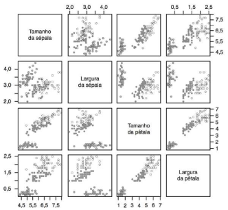

## Discretização

# Requisitos

1. Instale o python

2. crie um virtual env
   
   * ```bash
     python3 -m venv venv
     ```

3. Instale as bibliotecas que mais serão utilizadas
   
   * ```bash
     pip install pandas
     ```
   
   * ```bash
     pip install maplotlib
     ```
   
   * ```bash
     pip install seaborn
     ```
   
   * ```bash
     pip install scikit-learn
     ```
   
   * ```bash
     pip install imbalanced-learn     
     ```

&nbsp;

&nbsp;

------------------

# Preparando dados

## Conjunto de dados

Conjunto de dados são formados por objetos que podem representar um objeto físico , como uma cadeira , ou uma __noção abstrata__ , como os sintomas apresentados por um paciente que se dirige a um hospital. Em geral objeto é descrito por um conjunto de atributos de entrada ou um vetor de cacteristicas.

O Conjunto de dados poderia ser representado por uma matriz de objetos : 

$$
\large X_{n\times d}
$$

$\large n$ : é o números de **objetos** (_coluna_)

$\large d$ : é o números de **atributos de entrada** de cada objetos  (_linha_)

| nome   | idade | cpf     |
|:------:|:-----:|:-------:|
| Mateus | 19    | 000000  |
| Maria  | 20    | 10100   |
| Amanda | 22    | 1010101 |

$\large X_{ 0 \times 1 }$ :  19

$\large X_{1 \times 0} $ :  Maria

Devido a crescente do número de base de dados disponíveis , na maioria das vezes não é possível utilizar algoritmos de **Aprendizado de Máquina(AM)** diretamente sobre esses dados. Com isso, faz necessário utilizar técnicas de processamento de dados ,para torna o conjunto de dados mais adequado para o uso de algoritmos de **AM**. As técnicas podem ser agrupadas nos seguintes grupos de tarefas :

* Eliminação manual dos atributos;

* Integração dos dados;

* Amostragem de dados;

* Balanceamento de dados;

* Limpeza de dados;

* Redução de dimensionalidade;

* Transformação de dados.

&nbsp;

-----

# Análise dos dados

## Categorizando os dados

### Tipo

O tipo define se o atributo representa quantidade , sendo então denominado **quantittaivo** ou numérico , ou qualidades , quando é chamado de **qualitativos**, simbólico ou categórico , pois os valores podem ser associados a categorias.

* **`Quantitativo`** : atributos de tipo numéricos
  
  * *`Contínuo`* = atributos que podem assumir infinitos valores.
  
  * *`Discreto`* = atributos que podem assumir finitos valores contável de valores .

* **`Qualitativos ou Categóricos`** : atributos do tipo string 

### Escala

A escala define as operações que podem ser realizadas sobre os valores do atributo


* **Atributo categórico binário**: é aquele que assumi apenas dois valores, e podem ser *também númericos* 
  
  * ex : atributo "gender"" possui dois valores únicos = ['female' , ' male'].

* **Atributo categórico Nominal** : é aquele cujos valores possuem símbolos ou rótulos distintos.
  
  * Por exemplo: o atributo “estado civil” pode assumir os valores  [“solteiro”,“casado”, “separado”, “divorciado”,“viúvo”].

* **Atributo categórico ordinal :** é aquele que permite ordenar suas categorias, embora não necessariamente haja uma noção explicita de distância entre as categorias
  
  * Por exemplo: o atributo “nível educacional” pode assumir
    os valores [“primário”, “secundário”, “graduação”,“especialização”,“mes trado”,“doutorado”]

* **Atributo numérico de razão(Intervalar)** : são aquelas para as quais o método de medida define o ponto zero.

## Analise exploratória dos dados

E importante pois ajuda na detecção de outliers

1. **Describe**
   
   * ```python
     data[['nome de colunas do tipo númerico']].describe()
     ```

2. **Histograma**: Ele é especialmente útil para visualizar a forma da distribuição, identificar tendências centrais e identificar a presença de picos, assimetrias e outros padrões.
   
   * ```python
     sea.histplot(x = data[['nome da coluna']])
     plt.show()
     ```

3. **Violino** : Ele é usado para visualizar a distribuição de dados e é particularmente útil para comparar a distribuição de várias categorias ou grupos.
   
   * ```python
     sea.violinplot(
         x = data[['valores']],
         y = data[['categorias']],
         hue = data[['em relação']]
     )
     plt.show()
     #(Y):eixo vertical representa as 
     #categorias ou grupos que você deseja comparar.
     
     #(X): O eixo horizontal 
     #geralmente representa a faixa de valores dos dados.
     ```

4. **Boxplot** :uma representação gráfica que permite visualizar a distribuição estatística de um conjunto de dados, destacando a mediana, quartis e possíveis valores atípicos (outliers). **É uma ferramenta útil para identificar a dispersão dos dados e a presença de valores extremos**.
   
   * ```python
     sea.boxplot( data[['bmi','age','avg_glucose_level']])
     plt.show()
     ```

5. **Outras formas**
   
   1. **Pie**
   
   2. **Bar**
   
   3. **Scatter**
   
   4. **Métodos de analises**
      
      * media
      
      * mediana
      
      * quantidade
      
      * relação de um atributo com outro

-------

# Pré-Processamento de dados

## Eliminação manual de atributos

Na analise dos dados dados pode ser ver atributos ou dados irelevante para a predição do atributo alvo.

## Limpeza dos Dados

### Valores ausentes

Um valor ausente costuma ser representando por um código de ausencia , que pode ser um valor específico , **NaN** | **NULL**. Métodos tradicionais de imputação de valores ausentes são:

#### **Ignorar o objeto**

Consiste em remover da base todos aqueles objetos que possuem um ou mais valores ausentes. **Esse método não é muito recomendado**.

```python
data.dropna(inplace=True)
```

&nbsp;

#### Imputar manualmente os valores ausentes *

Consiste em escolher de forma empírica um valor a ser imputado para cada valor ausente. **Esse método também não é muito recomendado**, é importante que os valores imputados respeitem o domínio de cada atributo.

&nbsp;

#### Usar uma constante global para imputar o valor *

Significa que você preencherá todos os valores ausentes em seu conjunto de dados com um único valor constante em todas as variáveis em que os valores estão faltando. Não é bastante recomendada.

**O que usar:**

* **Zero (0)** 

* **Média ou mediana da coluna:** 

* **Moda da coluna**

* **Valores específicos:**

&nbsp;

#### Imputação do tipo hot-deck *

Em um conjunto de dados são substituídos por valores observados em amostras de dados semelhantes. É uma técnica que utiliza informações de observações reais dentro do conjunto de dados para estimar os valores ausentes. 

> A ideia básica é "emprestar" valores de outras observações que se assemelham à observação com valor ausente.

1. **Hot-Deck Simples:** Neste método, um valor ausente é substituído pelo valor de uma observação similar existente no conjunto de dados. A observação de referência pode ser selecionada com base em critérios como proximidade geográfica, similaridade em outras variáveis, ou outros fatores relevantes.

2. **Hot-Deck por Grupo:** Neste método, os dados são divididos em grupos com base em características comuns (por exemplo, idade, gênero, categoria de produtos) e, em seguida, os valores ausentes são imputados com base em observações dentro do mesmo grupo.

3. **Hot-Deck por Vizinhança:** A abordagem de vizinhança envolve a seleção de observações semelhantes com base em medidas de distância ou similaridade, como a distância euclidiana ou a similaridade de cosseno. Os valores ausentes são então imputados com base nas observações mais próximas.

4. **Hot-Deck por Amostragem Aleatória**

&nbsp;

#### Imputar de acordo com a última observação *

Envolve ordenar a base de dados seguindo um ou mais de seus atributos. Feito
isso, o algoritmo busca cada valor ausente e usa aquele valor da célula imediatamente anterior para imputar o valor ausente, processo este que é repetido até que todos os valores ausentes tenham sido imputados.

&nbsp;

#### Usar a média ou moda de um atributo para imputar o valor ausente

método consiste em substituir os valores ausentes de cada atributo pela média (no caso de atributos numéricos) ou moda (no caso de atributos nominais) dos valores do atributo. **Essa técnica é bastante usada na prática, mas desconsidera as diferenças entre as classes e é suscetível a outliers**.

&nbsp;

#### Imputação com base em informações auxiliares

Esses dados adicionais podem ser obtidos a partir de fontes externas, de outras variáveis no mesmo conjunto de dados ou de conhecimento especializado. Essa abordagem pode ser particularmente útil quando você deseja imputar valores ausentes de maneira mais precisa e informada.

&nbsp;

### Dados Incosistentes

&nbsp;

### Dados Redundantes

* Eles se repentem no meu conjunto de dados , por exemplo , tenho 2 linhas iguais no conjunto de dados

### Dados Ruídosos

- Dados ruidosos referem-se a dados que contêm erros aleatórios, imprecisões ou flutuações irrelevantes que não seguem um padrão discernível.
- O ruído nos dados pode ser causado por várias razões, como erros de medição, variações temporais, problemas de sensoriamento, entre outros.

&nbsp;

## Tranformação de dados

Conventer dados categoricos para numericos

* Converter valores categoricos para numericos

* **Normalização**

* **Padronização**

## Balanceamento dos dados

* **`undersampling`**

* **`oversampling`**

## Discretização

Análise de dados que envolve a conversão de variáveis contínuas em variáveis discretas.

1. **Simplificação:** Em muitos algoritmos de machine learning, é mais fácil lidar com variáveis discretas do que contínuas. A discretização pode simplificar o problema.

2. **Pré-processamento de dados:** A discretização é uma etapa comum no pré-processamento de dados, permitindo que os algoritmos lidem com variáveis contínuas.

3. **Interpretabilidade:** Em algumas situações, transformar variáveis contínuas em categorias discretas pode tornar os resultados mais interpretáveis.

#### Existem várias técnicas de discretização, incluindo:

1. **Discretização de Binning:** Esta técnica envolve a divisão de uma variável contínua em intervalos (ou bins) e atribuição de um rótulo ou valor categórico a cada intervalo

2. **Discretização baseada em frequência:** Nesta abordagem, você divide os dados de forma que cada categoria tenha aproximadamente o mesmo número de amostras.

3. **Discretização baseada em quantis:** Divide os dados de forma que cada categoria tenha aproximadamente a mesma amplitude ou variação. Por exemplo, você pode criar categorias com base em quartis ou percentis.

4. **Discretização baseada em árvores de decisão:** Algoritmos de árvores de decisão, como o C4.5 ou CART, podem ser usados para encontrar automaticamente os pontos de divisão ótimos para discretizar uma variável.

## &nbsp;

------

# Modelos Preditivos

### Classificação

**O objetivo é atribuir uma categoria ou classe a um dado de entrada com base em suas características. O objetivo é prever a qual classe ou categoria um ponto de dados pertence.** As classes são pré-definidas e discretas.

- Classificar se um e-mail é spam ou não spam.
- Identificar se uma imagem contém um gato ou um cachorro.
- Prever se um paciente tem uma doença com base em seus sintomas.

### Regressão

**É uma tarefa de aprendizado de máquina que se concentra na previsão de valores numéricos ou contínuos com base em um conjunto de dados de entrada.** O objetivo é modelar a relação entre as variáveis independentes (características) e a variável dependente (o valor a ser previsto).

* Prever o preço de uma casa com base em características como tamanho, número de quartos, localização, etc.
- Estimar a receita de uma empresa com base em métricas de desempenho.
- Prever a temperatura com base em dados meteorológicos históricos.

&nbsp;

&nbsp;

-----

# Métodos baseados em distâncias

   Hipótese base é que dados similares tendem a estar concentrados em uma mesma região no espaço de entrada. De maneira alternativa , dados que não são similares estarão distantes entre si.



---

# Outliers
