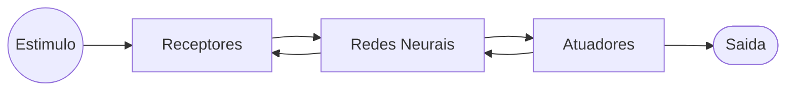

# Redes Neurais

Redes neurais é uma máquina que é projetada para modelar a maneira como o cérebro realiza uma tarefa particular ou função de interesse; a rede é normalmente implementada utilizando-se compenentes eletronicos ou é simulada por programação em um computador digital.

Uma rede neural é um processador maciçamente paralelamente distribuído constituído de unidades de processamento simples, que tem propensão natural para armazenar conhecimento experimental e torna-lo disponível para o uso. Ela se assemelha ao cérebro em dois aspectos:

1. O conhecimento é adquirido pela rede a partir de seu ambiente através de um processo de  aprendizagem

2. Forças de conexão entre neuronios , conhecidas como pesos sinapticos , são utilizadas para armazenar o conhecimento adquirido

## Cérebro Humano

