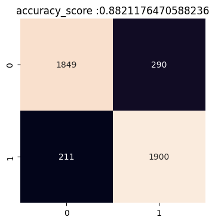
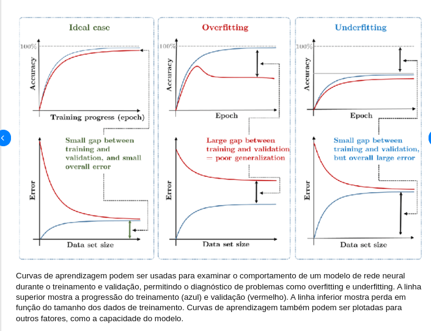
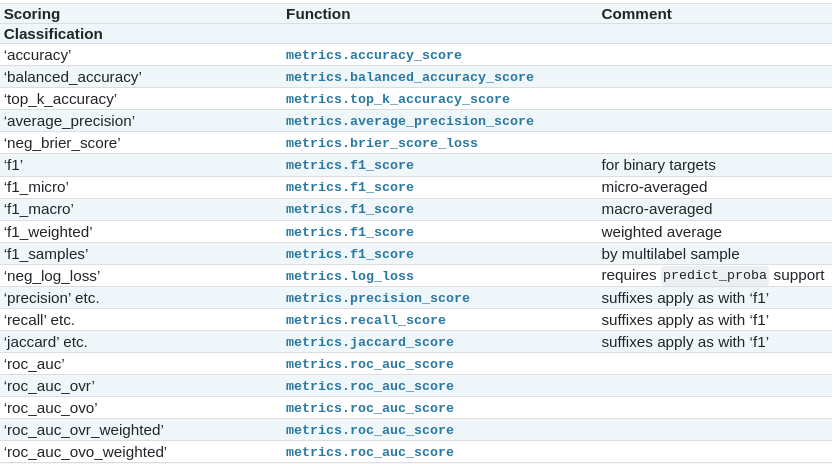
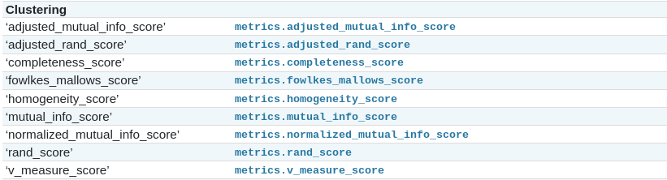
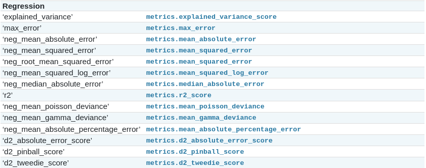

# Pré-Processamento de Dados

&nbsp;

## Limpeza de dados - Valores ausentes

### **SimpleImputer**

Esta classe permite a imputação de valores ausentes usando estratégias simples, como a média, mediana, valor mais frequente ou um valor constante. **Normalmente usado em valores numericos**

1. **strategy**: Este é o parâmetro mais importante e determina a estratégia usada para imputação. Você pode escolher entre as seguintes opções:
   
   - `'mean'`: Preenche os valores ausentes com a média da coluna.
   - `'median'`: Preenche os valores ausentes com a mediana da coluna.
   - `'most_frequent'`: Preenche os valores ausentes com o valor mais frequente da coluna.
   - `'constant'`: Preenche os valores ausentes com um valor constante que você especifica usando o parâmetro `fill_value`.

2. **fill_value (default=0)**: Este parâmetro é usado quando a estratégia é definida como `'constant'`. Permite especificar o valor constante que será usado para preencher os valores ausentes.

3. **missing_values**: Define o valor que é considerado como valor ausente. Por padrão, é definido como `np.nan`, mas você pode alterá-lo se seus valores ausentes forem representados de maneira diferente.

4. **copy**: Controla se uma cópia dos dados é criada antes da imputação. O padrão é `True`, o que significa que os dados de entrada não são modificados. Se definido como `False`, os valores ausentes são imputados nos dados de entrada diretamente.

5. **add_indicator**: Se definido como `True`, o `SimpleImputer` adiciona uma matriz indicadora de valores ausentes ao conjunto de dados, informando quais valores foram imputados.

```python
from sklearn.impute import SimpleImputer

# Criar uma instância do SimpleImputer com a estratégia da média
imputer = SimpleImputer(strategy='mean', fill_value=None, add_indicator=False)

# Ajustar o imputador aos dados e transformar os valores ausentes
data_imputed = imputer.fit_transform(data)
```

&nbsp;

### **KNNImputer**

Essa classe utiliza o algoritmo K-vizinhos mais próximos (KNN) para imputar valores ausentes com base nos valores de vizinhos mais próximos no conjunto de dados.

1. **n_neighbors**: Especifica o número de vizinhos a serem considerados ao imputar um valor ausente. Quanto maior o valor, mais influência os vizinhos terão na imputação. O padrão é 5.

2. **weights**: Define a estratégia de ponderação dos vizinhos ao imputar valores ausentes. Pode ser configurado como `'uniform'` (todos os vizinhos têm o mesmo peso) ou `'distance'` (os vizinhos mais próximos têm mais peso). O padrão é `'uniform'`.

3. **metric**: Determina a métrica de distância usada para calcular a proximidade entre amostras. Você pode escolher entre várias métricas, como `'nan_euclidean'`, `'manhattan'`, `'euclidean'`, entre outras. O padrão é `'nan_euclidean'`, que trata os valores ausentes como "nan" e ignora esses valores ao calcular a distância.

4. **row_max_missing**: Limita o número máximo de valores ausentes permitidos em uma linha (amostra). Se uma linha tiver mais valores ausentes do que o valor definido, ela não será usada para imputação. O padrão é `None`, o que significa que não há limite.

5. **col_max_missing**: Limita o número máximo de valores ausentes permitidos em uma coluna (atributo). Se uma coluna tiver mais valores ausentes do que o valor definido, ela não será usada para imputação. O padrão é `None`, o que significa que não há limite.

6. **add_indicator**: Se definido como `True`, o `KNNImputer` adiciona uma matriz indicadora de valores ausentes ao conjunto de dados, informando quais valores foram imputados.

```python
from sklearn.impute import KNNImputer
import numpy as np

# Criar um conjunto de dados de exemplo com valores ausentes
data = np.array([[1, 2, np.nan],
                 [4, np.nan, 6],
                 [7, 8, 9]])

# Criar uma instância do KNNImputer com parâmetros personalizados
imputer = KNNImputer(n_neighbors=3, weights='distance', metric='nan_euclidean', add_indicator=True)

# Ajustar o imputador aos dados e transformar os valores ausentes
data_imputed = imputer.fit_transform(data)

# Os valores ausentes foram imputados com base nos vizinhos mais próximos
print(data_imputed)
```

&nbsp; 

### **IterativeImputer**

Este método usa regressão para estimar valores ausentes iterativamente, tornando-o mais flexível, mas também mais computacionalmente intensivo.

1. **estimator**: Especifica o estimador (modelo de regressão) que será usado para imputação. Você pode fornecer qualquer estimador do scikit-learn, como `LinearRegression`, `RandomForestRegressor`, `KNeighborsRegressor`, entre outros. O padrão é `LinearRegression`.

2. **max_iter**: Define o número máximo de iterações a serem realizadas durante o processo de imputação. Cada iteração refina as estimativas dos valores ausentes. O padrão é 10.

3. **random_state**: Controla a semente de aleatoriedade usada para inicializar o estimador. Isso garante reprodutibilidade nos resultados. Se for definido como um valor inteiro, os resultados serão reproduzíveis. O padrão é `None`.

4. **tol**: Define um limite de convergência. Se a diferença média entre estimativas sucessivas de valores ausentes for menor que `tol`, a imputação é considerada como convergente e o processo é encerrado. O padrão é 1e-3.

5. **verbose**: Controla o nível de verbosidade durante o processo de imputação. Um valor maior que 0 gera saída de depuração. O padrão é 0 (sem saída).

6. **n_nearest_features**: Especifica o número de características mais próximas a serem usadas para estimar o valor de uma característica ausente. O padrão é `None`, o que significa que todas as características disponíveis são usadas.

> **Estimadores**:
> 
> 1. **LinearRegression**
> 
> 2. **BayesianRidge**
> 
> 3. **RandomForestRegressor**
> 
> 4. **KNeighborsRegressor**
> 
> 5. **DecisionTreeRegressor** 
> 
> 6. **GradientBoostingRegressor** 
> 
> 7. **SVR (Support Vector Regression)** 
> 
> 8. **ElasticNet**

```python
from sklearn.experimental import enable_iterative_imputer
from sklearn.impute import IterativeImputer
import numpy as np

# Criar um conjunto de dados de exemplo com valores ausentes
data = np.array([[1, 2, np.nan],
                 [4, np.nan, 6],
                 [7, 8, 9]])

# Criar uma instância do IterativeImputer com um estimador personalizado
from sklearn.linear_model import BayesianRidge
imputer = IterativeImputer(estimator=BayesianRidge())

# Ajustar o imputador aos dados e transformar os valores ausentes
data_imputed = imputer.fit_transform(data)

# Os valores ausentes foram imputados usando o estimador especificado
print(data_imputed)
```

&nbsp;

&nbsp;

------------------------------

## Tranformação de dados

```python
import pandas as pd
from sklearn.preprocessing import LabelBinarizer,LabelEncoder,HotEncoder
```

* **pd.get_dummies**

* **LabelBinarizer** : str para valor numerico binário

* **LabelEncoder**: str para valor numérico

* **OneHotEncoder**: similar ao `pd.get_dummies` 

### Normalização

É um processo importante no pré-processamento de dados que visa ajustar a escala de diferentes atributos ou variáveis para que eles estejam em uma faixa comparável.

- Essa técnica ajusta os valores de um atributo para um intervalo específico, geralmente entre 0 e 1.
  - $\large X_norm = \frac{(X - X_min)}{(X_max - X_min)}$

```python
from sklearn.preprocessing import MinMaxScaler

# Crie uma instância do MinMaxScaler
scaler = MinMaxScaler()

# Ajuste o scaler aos dados e transforme-os
X[['colunas']] = scaler.fit_transform(X[['colunas']])
```

### Padronização

* Padroniza os dados, transformando-os em uma distribuição com média zero e desvio padrão igual a 1

*  $\large x_scaled =  \frac{(x - mean)}{std}$
  
  ```python
  from sklearn.preprocessing import StandardScaler
  
  # Crie uma instância do StandardScaler
  scaler = StandardScaler()
  
  # Ajuste o scaler aos dados de treinamento e transforme-os
  X[['colunas']] = scaler.fit_transform(X[['colunas']])
  ```

### PolynomialFeatures

É uma classe que permite a geração de características polinomiais a partir de características originais. Isso é útil em modelos de regressão polinomial, onde você pode transformar suas características originais em características polinomiais de ordem superior para capturar relações mais complexas.

```python
from sklearn.preprocessing import PolynomialFeatures
import numpy as np

# Exemplo de dados
X = np.array([[1, 2],
              [3, 4]])

# Criar um objeto PolynomialFeatures de grau 2
poly = PolynomialFeatures(degree=2)

# Aplicar a transformação aos dados
X_poly = poly.fit_transform(X)

# Imprimir os dados transformados
print(X_poly)
```

&nbsp;

## Balanceamento dos Dados

### UnderSampling

```python
from imblearn.under_sampling import RandomUnderSampler

under = RandomUnderSampler(sampling_strategy = 'majority' , random_state=42)

xUnder ,yUnder = under.fit_resample(X,Y)
```

Quando se tem desequilíbrio de classe, significa que uma classe de interesse tem significativamente menos exemplos do que a outra classe. Nesses casos, o algoritmo de aprendizado tende a favorecer a classe majoritária, ignorando a classe minoritária.

### OverSampling

```python
from imblearn.over_sampling import RandomOverSampler

over = RandomOverSampler(sampling_strategy = 'majority' , random_state=42)

xOver ,yOver = over.fit_resample(X,Y)
```

O desequilíbrio de classe ocorre quando uma classe de interesse tem significativamente menos exemplos do que outra classe, o que pode levar a um viés do modelo em direção à classe majoritária. A técnica de "oversampling" lida com esse desequilíbrio aumentando o número de exemplos da classe minoritária.

&nbsp;

&nbsp;

------------------

## Avaliação de Modelos de classificação

```python
from sklearn.metrics import (
                    accuracy_score,
                    confusion_matrix,
                    f1_score,
                    recall_score
                    )
```

### Acuracia (0 até 1)

* É uma métrica comum usada para avaliar o desempenho de modelos de classificação em aprendizado de máquina. Ela mede a proporção de previsões corretas em relação ao total de previsões

```python
accuracy_score(ytest,pred)
```

### Matriz de confusão

* Uma tabela usada em problemas de classificação em aprendizado de máquina para avaliar o desempenho de um modelo.

```python
import seaborn as sea
from   sklearn.metrics import confusion_matrix

splt.figure(figsize=(4,4))
sea.heatmap( confusion_matrix(ytest,pred), annot=True ,cbar=False,fmt='')
plt.title(f'accuracy_score :{accuracy_score(ytest,pred)}')
plt.show()klearn.metrics import confusion_matrix
```



### Recall (0 até 1)

* A revocação mede a proporção de verdadeiros positivos em relação ao total de casos verdadeiramente positivos (verdadeiros positivos mais falsos negativos). Ela avalia a capacidade do modelo de identificar todos os casos positivos.

```python
recall_score(ytest,pred)
```

### f1-score

* É particularmente útil quando se deseja um equilíbrio entre precisão e revocação e não se pode priorizar uma métrica sobre a outra.

```python
f1_score(ytest,pred)
```

### AUC-ROC

* Uma métrica que avalia o desempenho de um modelo de classificação em termos de sua capacidade de distinguir entre as classes.

```python
from yellowbrick.classifier import ROCAUC
from yellowbrick.datasets import load_spam

# Load the classification dataset
X, y = load_spam()

# Create the training and test data
X_train, X_test, y_train, y_test = train_test_split(X, y, random_state=42)

# Instantiate the visualizer with the classification model
model = LogisticRegression(multi_class="auto", solver="liblinear")
visualizer = ROCAUC(model, classes=["not_spam", "is_spam"])

visualizer.fit(X_train, y_train)        
visualizer.score(X_test, y_test)        
visualizer.show()                     
```

### Learning Curve

```python
from yellowbrick.datasets import load_game
from yellowbrick.model_selection import LearningCurve

# Load a classification dataset
X, y = load_game()

# Encode the categorical data
X = OneHotEncoder().fit_transform(X)
y = LabelEncoder().fit_transform(y)

# Create the learning curve visualizer
cv = StratifiedKFold(n_splits=12)
sizes = np.linspace(0.3, 1.0, 10)

# Instantiate the classification model and visualizer
model      = MultinomialNB()
visualizer = LearningCurve(
    model, cv=cv, scoring='f1_weighted', train_sizes=sizes, n_jobs=4
)
visualizer.fit(X, y)        # Fit the data to the visualizer
visualizer.show() 
```

### Validation Curve

```python
from yellowbrick.model_selection import ValidationCurve

from sklearn.tree import DecisionTreeRegressor

# Load a regression dataset
X, y = load_energy()

viz = ValidationCurve(
    DecisionTreeRegressor(), param_name="max_depth",
    param_range=np.arange(1, 11), cv=10, scoring="r2"
)

# Fit and show the visualizer
viz.fit(X, y)
viz.show()
```



&nbsp;

&nbsp;

----------------------

## Validação cruzada

### Kfold

```python
from sklearn.model_selection import KFold

for train_index, test_index in kf.split(X):

    X_train, X_test = X[train_index], X[test_index]
    y_train, y_test = y[train_index], y[test_index]
    # Treine seu modelo com X_train e y_train
    # Avalie seu modelo com X_test e y_test
```

1. `n_splits`: Especifica o número de folds (partições) que você deseja dividir seus dados. Este é o parâmetro principal que determina o número de iterações na validação cruzada.

2. `shuffle`: Por padrão, a validação cruzada K-fold divide seus dados sequencialmente. No entanto, definir `shuffle=True` embaralhará os dados antes da divisão, o que pode ser útil para evitar ordens específicas nos dados.

3. `random_state`: Isso permite que você defina uma semente para a aleatoriedade quando o embaralhamento é usado. Isso é útil para garantir que os resultados da validação cruzada sejam reproduzíveis.

&nbsp;

### StratifiedKFold

```python
from sklearn.model_selection import StratifiedKFold

# Crie uma instância da classe StratifiedKFold
skf = StratifiedKFold(n_splits=5, shuffle=True, random_state=42)

# Suponha que você tenha seus dados X e y
X = ...
y = ...
# Use o StratifiedKFold para dividir os dados em folds de treinamento e teste
for train_index, test_index in skf.split(X, y):
    X_train, X_test = X[train_index], X[test_index]
    y_train, y_test = y[train_index], y[test_index]

    # Aqui, você treina e avalia seu modelo nos subconjuntos de treinamento e teste
    # O código para treinar e avaliar o modelo deve ser colocado aquiEuma variação do método `KFold` no scikit-learn que leva em consideração as distribuições das classes (ou categorias) em um conjunto de dados durante a divisão das dobras na validação cruzada. Ele é especialmente útil quando você está trabalhando com conjuntos de dados desequilibrados, nos quais algumas classes têm muito mais amostras do que outras.
```

É uma variação do método `KFold` no scikit-learn que leva em consideração as distribuições das classes (ou categorias) em um conjunto de dados durante a divisão das dobras na validação cruzada. **Ele é especialmente útil quando você está trabalhando com conjuntos de dados desequilibrados, nos quais algumas classes têm muito mais amostras do que outras.**

1. `n_splits`: Especifica o número de dobras (folds) a serem criadas na validação cruzada. Este é o número de vezes que o conjunto de dados é dividido em treinamento e teste. Por padrão, é definido como 5.

2. `shuffle`: Se definido como `True`, os dados serão embaralhados antes de criar as dobras. Isso é útil para evitar qualquer ordem intrínseca nos dados que possa afetar o desempenho da validação cruzada. O valor padrão é `False`.

3. `random_state`: É uma semente aleatória usada para controlar o embaralhamento dos dados, se `shuffle` for definido como `True`. Usar um valor de `random_state` ajuda a garantir a reprodutibilidade dos resultados.

&nbsp;

### Diferenças Kfold X StratifiedKFold

- No `KFold` padrão, as dobras são criadas de forma aleatória, o que pode levar a dobras com distribuições desiguais das classes.

- No `StratifiedKFold`, as dobras são criadas de modo que a distribuição de classes seja mantida em cada dobra. Isso significa que, em cada dobra, a proporção das diferentes classes será aproximadamente a mesma que a proporção no conjunto de dados original.

&nbsp;

### cross_val_score

```python
from sklearn.model_selection import cross_val_score
from sklearn.ensemble import RandomForestClassifier

# Suponha que você tenha dados (X, y) e um modelo, como um RandomForestClassifier
model = RandomForestClassifier()

# Use cross_val_score para avaliar o desempenho do modelo usando validação cruzada k-fold (por exemplo, k=5)
scores = cross_val_score(model, X, y, cv=5)

# A função retorna uma matriz de pontuações, uma para cada dobra da validação cruzada
print("Pontuações de validação cruzada:", scores)

# Você pode calcular a pontuação média e o desvio padrão das pontuações
print("Pontuação média:", scores.mean())
print("Desvio padrão das pontuações:", scores.std())
```

Permite que você avalie o desempenho de um estimador (um modelo) aplicando validação cruzada em seus dados. Isso envolve dividir o conjunto de dados em várias partes, treinar o modelo em uma parte e testá-lo nas outras partes. Isso ajuda a estimar o quão bem o modelo generaliza para dados não vistos.

&nbsp;

### GridSearchCV

```python
from sklearn.model_selection import GridSearchCV
from sklearn.ensemble import RandomForestClassifier
from sklearn.datasets import load_iris

# Carregue um conjunto de dados (por exemplo, o conjunto de dados Iris)
data = load_iris()
X, y = data.data, data.target

# Defina o modelo para otimização (neste caso, um RandomForestClassifier)
model = RandomForestClassifier()

# Defina um dicionário de hiperparâmetros para pesquisar
param_grid = {
    'n_estimators': [10, 50, 100],
    'max_depth': [None, 10, 20],
    'min_samples_split': [2, 5, 10]
}

# Crie um objeto GridSearchCV
grid_search = GridSearchCV(model, param_grid, cv=5)

# Ajuste o objeto GridSearchCV aos dados
grid_search.fit(X, y)

# Obtenha os melhores hiperparâmetros encontrados
best_params = grid_search.best_params_
print("Melhores hiperparâmetros:", best_params)

# Obtenha o melhor desempenho do modelo
best_score = grid_search.best_score_
print("Melhor pontuação:", best_score)
```

É uma técnica de otimização de hiperparâmetros utilizada em aprendizado de máquina para encontrar a combinação ideal de hiperparâmetros de um modelo. Isso é feito por meio da pesquisa sistemática em um espaço de hiperparâmetros especificado.

1. `estimator`

2. `param_grid`

3. `scoring`: Especifica a métrica que você deseja otimizar

4. `cv`: Especifica a estratégia de validação cruzada a ser usada.

5. `n_jobs`: Define o número de núcleos de CPU a serem usados para paralelizar o processo de pesquisa de hiperparâmetros.
   
   * 1. **Valor positivo inteiro:** Se você especificar um número inteiro positivo (por exemplo, 2, 4, ou -1), o scikit-learn usará esse número de núcleos de CPU para paralelizar a busca de hiperparâmetros. Um valor de -1 indica que todos os núcleos disponíveis devem ser usados.
     
     2. **Valor 0:** Se você definir `n_jobs` como 0, a busca de hiperparâmetros será executada em um único núcleo, sem paralelização.
     
     3. **Valor negativo:** Se você definir `n_jobs` como um número negativo (por exemplo, -2 ou -3), o scikit-learn tentará usar todos os núcleos disponíveis, exceto os especificados pelo número negativo.

6. `verbose`: Controla a quantidade de saída durante a busca de hiperparâmetros. Quanto maior o valor, mais informações de registro são impressas na saída padrão.

7. `refit`: Especifica se o modelo deve ser ajustado com os melhores hiperparâmetros encontrados após a pesquisa. Isso é útil se você deseja obter o modelo final treinado com os melhores parâmetros após a pesquisa.

> E para usar o conjunto de treinamento

&nbsp;

### RandomizedSeachCV

```python
from sklearn.model_selection import RandomizedSearchCV
from sklearn.ensemble import RandomForestClassifier

# Defina a grade de hiperparâmetros
param_grid = {
    'n_estimators': [10, 50, 100, 200],
    'max_depth': [None, 10, 20, 30],
    'min_samples_split': [2, 5, 10],
    'min_samples_leaf': [1, 2, 4]
}

# Crie um modelo
rf_model = RandomForestClassifier()

# Realize a pesquisa aleatória
random_search = RandomizedSearchCV(rf_model, param_distributions=param_grid, n_iter=10, cv=5)
random_search.fit(X_train, y_train)
```

**Pesquisa Aleatória de Hiperparâmetros**: Ao contrário de uma pesquisa em grade, em que você especifica explicitamente uma grade de valores para cada hiperparâmetro, o `RandomizedSearchCV` seleciona aleatoriamente combinações de hiperparâmetros a partir de distribuições pré-definidas. Isso permite uma exploração mais eficiente do espaço de hiperparâmetros, especialmente quando o espaço é vasto.

&nbsp;

--------------

# Pipeline

------------------

## Conjunto de testes

## StratifiedShuffleSplit

Uma técnica de divisão de dados frequentemente usada em aprendizado de máquina para criar conjuntos de treinamento e teste a partir de um conjunto de dados.

* **Estratificação**: O `StratifiedShuffleSplit` leva em consideração a distribuição das classes no conjunto de dados. Isso significa que ele garante que a proporção de exemplos de cada classe seja mantida tanto no conjunto de treinamento quanto no conjunto de teste.

* **Embaralhamento**: A palavra "Shuffle" no nome refere-se ao fato de que o conjunto de dados é embaralhado antes de fazer a divisão.

* Divisão aleatória: O "Split" no nome indica que os dados são divididos em conjuntos de treinamento e teste de maneira aleatória.

----------------

# SCORING




